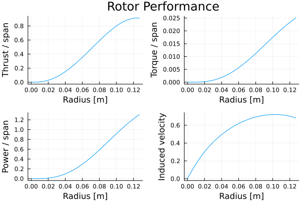

# BEMT.jl

## About this package

### Purpose

The `BEMT.jl` package provides a basic implementation of Blade Element Momentum Theory for the analysis of rotors and propellers. It has been designed to support the delivery of the Integrated Project (Level 2) as part of the Aerospace Engineering Programme at the University of Nottingham. Thus, the target users for this package are Aerospace students at Nottingham. The code has been released with an MIT license so anyone interested is welcome to use the package/code freely.

By design, the functionality provided is basic, but composable, to both encourage and allow users to extent/adopt the code to suit their needs.

The Julia programming language was chosen for implementing this package because it is a high-level programming language which is relatively straight forward to learn (especially for Matlab and Python users). Julia also offers excellent performance and it makes it almost trivial to share and deploy code.

### Reporting issues

University of Nottingham students should report any issues directly to Humberto Medina. Users outside the University are kindly asked to open an issue in Github.

Please include a minimal working example to illustrate the issue/bug when reporting or opening an issue.

### Feature requests and contributions

If you have a feature request, please open an issue explaining the feature, keeping in mind that this is not meant to be a production code. Ideally, feature request will include an educational argument.

Contributions from both University of Nottingham students or community users are, of course, welcome. Please submit contributions as a pull request.

Please note that updates to this package are likely to be sporadic (typically once per year around the summer months).

## Getting started

### Installing Julia

The first step is to make sure you install Julia locally. Simply visit the website for [Julia](https://julialang.org/) to download and install it. It is recommended that you choose the option to add Julia to the path during installation (by ticking the appropriate box in the installer).

### Using Julia

When Julia is installed, you will be able to find it in your list of installed programmes. When you launch Julia you will be presented with the Julia REPL (Read-Evaluate-Print Loop). The REPL is the simplest way to get started using Julia. However, as you start to develop more complex analysis or scripts, it is recommended to use a more complete IDE. Currently, **vscode** is the probably the leading IDE used in industry. You can learn more about setting up the vscode environment for Julia [on this link](https://code.visualstudio.com/docs/languages/julia). For information about how to use Julia and its syntax, you should refer to the [Julia documentation](https://docs.julialang.org/).

### Recommended packages

Once you have installed Julia, you can extent its functionality by adding packages from the Julia ecosystem. As a starting point, the following packages are highly recommended:

1. `Plots.jl` this package can be used to generate high quality plots and charts
2. `Revise.jl` this package enhances the development experience in Julia (reducing the need to reload the REPL when writing Julia code)

To add packages all you need to do is open a REPL window and press "]" on your keyboard (without the quotations). This will make the REPL enter *package mode*. To install a package simply type `add` followed by the package name (without the extension). For example, to install the package `Plot.jl`, you should type:

```julia
add Plots
```

The process above can be repeated to install (or add) any packages officially registered with the Julia package repository.

### Installing `BEMT.jl`

The `BEMT.jl` package is not meant to be a production package, thus, it has not been officially registered as a Julia package. To add `BEMT.jl` to your local Julia installation, you need to add it using the URL to this Github repository. To do this, enter *package mode* by pressing "]" in the Julia REPL and type:

```julia
add https://github.com/mberto79/BEMT.git
```

### Update `BEMT.jl`

As it is common with software. It is likely that this package will be updated from time to time, for bug fixes or to add new functionality. To update your installation to a new version, first enter *package mode* by pressing "]" in the Julia REPL and then type:

```julia
update BEMT
```

## Basic usage example

Below is an example of the basic functionality provided in `BEMT.jl` which can be readily extended to perform more complex analyses. To run the example follow these steps:
- Create an empty directory in your local machine
- Open vscode and open the directory you created
- Create a new file (making sure to add the ".jl" file extension)
- Copy and paste the example below into the file
- Execute the code. You can do this line by line by pressing the shift and enter keys (on Windows and Linux)

Note the following:
- Ensure you have installed the BEMT.jl package (see installation instruction above)
- Ensure that both Julia and the Julia extension for vscode are installed.

```Julia
using Plots
using BEMT

# Define base directory where example datafiles are stored
examples_dir = pkgdir(BEMT, "examples")
data_dir = joinpath(examples_dir, "data")

# Define path for xfoil data file and loading
file_xfoil = joinpath(data_dir, "example1", "NACA001264_xfoil.csv")
cl, cd = load_xfoil(file_xfoil) # note cl and cd are functions

# Define path for fxlr5 data file and loading
file_xflr = joinpath(data_dir, "example1", "NACA0012_xflr5.txt")
cl, cd = load_xflr5(file_xflr) # note cl and cd are functions

# Define angle of attack range in degrees 
alpha = [-45:0.1:45;]

# Convert to radians
alpha_rad = deg2rad.(alpha) # apply deg2rad function element-wise (using ".")

# Plot alpha vs cl and cl 
plot(alpha, cl.(alpha_rad), label="Lift coefficient")

# Plot cd plot on top of previous plot - note "!" 
plot!(alpha, cd.(alpha_rad), label="Drag coefficient") 

# Add labels (documentation and options at Plots.jl)
plot!(xlabel="alpha", ylabel="Aerodynamic coefficients")


# Define propeller 
diameter = 25.40e-2
radius = diameter/2
nb = 2 # number of blades

# Operating conditions
vc = 0
rho = 1.225
rpm = 500
omega = rpm*(2π/60)
v_tip = omega*radius

# Define mesh for BET
n = 75
rotor = uniform_mesh(radius, nb, n)

# Define geometry (these are functions)
theta = linear_function(deg2rad(20), deg2rad(7.5), radius) # 20 to 7.5 degree twist
chord = constant_function(0.075) # constant chord of 0.075
# chord = linear_function(0.05, 0.02) # linear taper from 0.05 to 0.02 m

# Solve BEMT equations to determine induced velocity
vi, converged = calculate_vi(rotor, vc, rpm, theta, chord, cl, cd)

# Calculate aerodynamic performance
dT, dQ, dP = element_performance(rotor, vi, vc, rpm, rho, cl, cd, theta, chord)
dTm = thrust_momentum(rotor, vi, vc, rho) # used here as a check

# Integrate element results over the rotor blades
T = integrate(dT, rotor.r) # Rotor thrust prediction (by BEM)
Tm = integrate(dTm, rotor.r) # should be similar to the value of T
Q = integrate(dQ, rotor.r) # Rotor torque prediction
P = integrate(dP, rotor.r) # Rotor power prediction

# Plot results
p4 = plot(rotor.r, vi, label=:false, xlabel="Radius [m]", ylabel="Induced velocity")
p1 = plot(rotor.r, dT, label=:false, xlabel="Radius [m]", ylabel="Thrust / span")
p2 = plot(rotor.r, dQ, label=:false, xlabel="Radius [m]", ylabel="Torque / span")
p3 = plot(rotor.r, dP, label=:false, xlabel="Radius [m]", ylabel="Power / span")

plot(p1,p2,p3,p4, plot_title="Rotor Performance")
```


## A more advanced example: Effect of RPM

```julia
using Plots
using BEMT

# Define base directory where example datafiles are stored
examples_dir = pkgdir(BEMT, "examples")
data_dir = joinpath(examples_dir, "data")

# Define path for xfoil data file and loading
file_xfoil = joinpath(data_dir, "example1", "NACA001264_xfoil.csv")
cl, cd = load_xfoil(file_xfoil) # note cl and cd are functions

# Define path for fxlr5 data file and loading
file_xflr = joinpath(data_dir, "example1", "NACA0012_xflr5.txt")
cl, cd = load_xflr5(file_xflr) # note cl and cd are functions

# Define angle of attack range in degrees 
alpha = [-45:0.1:45;]

# Convert to radians
alpha_rad = deg2rad.(alpha) # apply deg2rad function element-wise (using ".")

# Plot alpha vs cl and cl 
plot(alpha, cl.(alpha_rad), label="Lift coefficient")

# Plot cd plot on top of previous plot - note "!" 
plot!(alpha, cd.(alpha_rad), label="Drag coefficient") 

# Add labels (documentation and options at Plots.jl)
plot!(xlabel="alpha", ylabel="Aerodynamic coefficients")


# Define propeller 
diameter = 15e-2
radius = diameter/2
nb = 3 # number of blades

# Define mesh for BET
n = 100
rotor = uniform_mesh(radius, nb, n)

# Define geometry (these are functions)
theta = linear_function(deg2rad(20), deg2rad(15), radius) # 20 to 7.5 degree twist
chord = constant_function(0.035) # constant chord of 0.075
# chord = linear_function(0.05, 0.02) # linear taper from 0.05 to 0.02 m
# chord = nonlinear_function([0.0, 0.25, 0.5, 1.0].*radius, [0.05, 0.04, 0.04, 0.025])

# Operating conditions
vc = 0
rho = 1.225
# rmp = 500 # Original setting for a single RPM run
rpm_range = 100:100:5000 # We want to loop over the RPM variable

# Pre-allocate output (single values are now vectors)

T = zeros(length(rpm_range))
Q = zeros(length(rpm_range))
P = zeros(length(rpm_range))
last_iter = length(rpm_range)

for (i, rpm) in enumerate(rpm_range)
    println("Evaluating rpm: ", rpm)

    omega = rpm*(2π/60)
    v_tip = omega*radius

    # Solve BEMT equations to determine induced velocity
    vi, converged = calculate_vi(rotor, vc, rpm, theta, chord, cl, cd, warnings=false)
    
    if !converged
        last_iter = i-1
        println("Last converged iteration ", last_iter)
        break 
    end

    # Calculate aerodynamic performance
    dT, dQ, dP = element_performance(rotor, vi, vc, rpm, rho, cl, cd, theta, chord)

    # Integrate element results over the rotor blades

    T[i] = integrate(dT, rotor.r) # Rotor thrust prediction (by BEM)
    Q[i] = integrate(dQ, rotor.r) # Rotor torque prediction
    # P[i] = integrate(dP, rotor.r) # Rotor power prediction

end

# Plot results
p1 = plot(
    rpm_range[1:last_iter], T[1:last_iter], 
    label="Thrust", xlabel="RPM", ylabel="T [N]"
    )
p2 = plot(
    rpm_range[1:last_iter], Q[1:last_iter], 
    label="Torque", xlabel="RPM", ylabel="Q [Nm]"
    )
# p3 = plot(
#     rpm_range[1:last_iter], P[1:last_iter], 
#     label="Power", xlabel="RPM", ylabel="Q [W]"
#     )

fig = plot(p1,p2) 
savefig(fig, "example2_results.png") # or .png, jpeg, etc. (see Plots.jl docs)
```