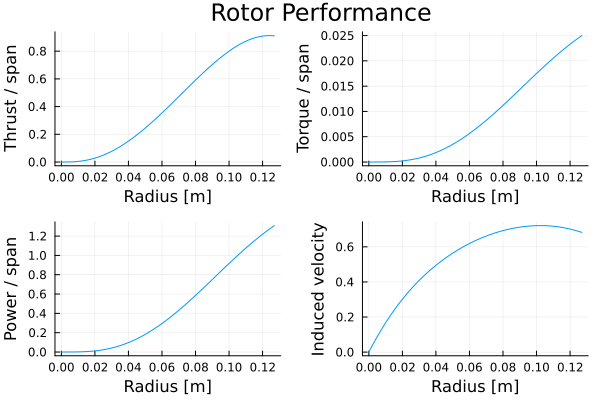

# BEMT.jl

## About this package

### Purpose

The `BEMT.jl` package provides a basic implementation of Blade Element Momentum Theory for the analysis of rotors and propellers. It has been designed to support the delivery of the Integrated Project (Level 2) as part of the Aerospace Engineering Programme at the University of Nottingham. Thus, the target users for this package are Aerospace students at Nottingham. The code has been released with an MIT license so anyone interested is welcome to use the package/code freely.

By design, the functionality provided is basic, but composable, to both encourage and allow users to extent/adopt the code to suit their needs.

The Julia programming language was chosen for implementing this package because it is a high-level programming language which is relatively straight forward to learn (especially for Matlab and Python users). Julia also offers excellent performance and it makes it almost trivial to share and deploy code.

### Reporting issues

University of Nottingham students should report any issues directly to Humberto Medina. Users outside the University are kindly asked to open an issue in Github.

Please include a minimal working example to illustrate the issue/bug when reporting or opening an issue.

### Feature requests and contributions

If you have a feature request, please open an issue explaining the feature, keeping in mind that this is not meant to be a production code. Ideally, feature request will include an educational argument.

Contributions from both University of Nottingham students or community users are, of course, welcome. Please submit contributions as a pull request.

Please note that updates to this package are likely to be sporadic (typically once per year around the summer months).

## Getting started

### Installing Julia

The first step is to make sure you install Julia locally. Simply visit the website for [Julia](https://julialang.org/) to download and install it. It is recommended that you choose the option to add Julia to the path during installation (by ticking the appropriate box in the installer).

### Using Julia

When Julia is installed, you will be able to find it in your list of installed programmes. When you launch Julia you will be presented with the Julia REPL (Read-Evaluate-Print Loop). The REPL is the simplest way to get started using Julia. However, as you start to develop more complex analysis or scripts, it is recommended to use a more complete IDE. Currently, **vscode** is the probably the leading IDE used in industry. You can learn more about setting up the vscode environment for Julia [on this link](https://code.visualstudio.com/docs/languages/julia). For information about how to use Julia and its syntax, you should refer to the [Julia documentation](https://docs.julialang.org/).

### Recommended packages

Once you have installed Julia, you can extent its functionality by adding packages from the Julia ecosystem. As a starting point, the following packages are highly recommended:

1. `Plots.jl` this package can be used to generate high quality plots and charts
2. `Revise.jl` this package enhances the development experience in Julia (reducing the need to reload the REPL when writing Julia code)

To add packages all you need to do is open a REPL window and press "]" on your keyboard (without the quotations). This will make the REPL enter *package mode*. To install a package simply type `add` followed by the package name (without the extension). For example, to install the package `Plot.jl`, you should type:

```julia
add Plots
```

The process above can be repeated to install (or add) any packages officially registered with the Julia package repository.

### Installing `BEMT.jl`

The `BEMT.jl` package is not meant to be a production package, thus, it has not been officially registered as a Julia package. To add `BEMT.jl` to your local Julia installation, you need to add it using the URL to this Github repository. To do this, enter *package mode* by pressing "]" in the Julia REPL and type:

```julia
add https://github.com/mberto79/BEMT.git
```

### Updating `BEMT.jl`

As it is common with software. It is likely that this package will be updated from time to time, for bug fixes or to add new functionality. To update your installation to a new version, first enter *package mode* by pressing "]" in the Julia REPL and then type:

```julia
update BEMT
```

## Example 1: Basic usage

Below is an example of the basic functionality provided in `BEMT.jl` which can be readily extended to perform more complex analyses. To run the example follow these steps:

- Create an empty directory in your local machine
- Open vscode and open the directory you created
- Create a new file (making sure to add the ".jl" file extension)
- Copy and paste the example below into the file
- Execute the code. You can do this line by line by pressing the shift and enter keys (on Windows and Linux)

Note the following:

- Ensure you have installed the BEMT.jl package using the process detailed below.
- Ensure that both Julia and the Julia extension for vscode are installed.

```Julia
using Plots
using BEMT

# Define base directory where example datafiles are stored
examples_dir = pkgdir(BEMT, "examples")
data_dir = joinpath(examples_dir, "data")

# Define path for xfoil data file and loading
file_xfoil = joinpath(data_dir, "example1", "NACA001264_xfoil.csv")
cl, cd = load_xfoil(file_xfoil) # note cl and cd are functions

# Define path for fxlr5 data file and loading
file_xflr = joinpath(data_dir, "example1", "NACA0012_xflr5.txt")
cl, cd = load_xflr5(file_xflr) # note cl and cd are functions

# Define angle of attack range in degrees 
alpha = [-45:0.1:45;]

# Convert to radians
alpha_rad = deg2rad.(alpha) # apply deg2rad function element-wise (using ".")

# Plot alpha vs cl and cl 
plot(alpha, cl.(alpha_rad), label="Lift coefficient")

# Plot cd plot on top of previous plot - note "!" 
plot!(alpha, cd.(alpha_rad), label="Drag coefficient") 

# Add labels (documentation and options at Plots.jl)
plot!(xlabel="alpha", ylabel="Aerodynamic coefficients")


# Define propeller 
diameter = 25.40e-2
radius = diameter/2
nb = 2 # number of blades

# Operating conditions
vc = 0
rho = 1.225
rpm = 500
omega = rpm*(2π/60)
v_tip = omega*radius

# Define mesh for BET
n = 75
rotor = uniform_mesh(radius, nb, n)

# Define geometry (these are functions)
theta = linear_function(deg2rad(20), deg2rad(7.5), radius) # 20 to 7.5 degree twist
chord = constant_function(0.075) # constant chord of 0.075
# chord = linear_function(0.05, 0.02) # linear taper from 0.05 to 0.02 m

# Solve BEMT equations to determine induced velocity
vi, converged = calculate_vi(rotor, vc, rpm, theta, chord, cl, cd)

# Calculate aerodynamic performance
dT, dQ, dP = element_performance(rotor, vi, vc, rpm, rho, cl, cd, theta, chord)
dTm = thrust_momentum(rotor, vi, vc, rho) # used here as a check

# Integrate element results over the rotor blades
T = integrate(dT, rotor.r) # Rotor thrust prediction (by BEM)
Tm = integrate(dTm, rotor.r) # should be similar to the value of T
Q = integrate(dQ, rotor.r) # Rotor torque prediction
P = integrate(dP, rotor.r) # Rotor power prediction

# Plot results
p4 = plot(rotor.r, vi, label=:false, xlabel="Radius [m]", ylabel="Induced velocity")
p1 = plot(rotor.r, dT, label=:false, xlabel="Radius [m]", ylabel="Thrust / span")
p2 = plot(rotor.r, dQ, label=:false, xlabel="Radius [m]", ylabel="Torque / span")
p3 = plot(rotor.r, dP, label=:false, xlabel="Radius [m]", ylabel="Power / span")

plot(p1,p2,p3,p4, plot_title="Rotor Performance")
```


## Example 2: Effect of RPM (the power of loops)

Now that we have a simple case set up and running (example 1), in this example the power of loops is illustrated. With some minor modifications and appropriate definitions output variables, with a single loop, it is possible to explore how different variables affect the performance of the rotor. In this case the RPM will be explored. You can easily take this example and modify it to suit your design needs, exploring alternative effects e.g. changing geometry, climb speed, chord, etc.

Note:

- The paths shown here are relative to the directory where the package `BEMT.jl` is installed. Ideally, you would change the paths here to a location of your choice in your local hard drive. The built-in function `joinpath` provides a safe method to define paths.
- In Julia, to access a variable that is modified inside a loop, it must first be defined outside of the loop e.g. T, Q and P in the example below.
- The use of the plotting package `Plots.jl` is showcased here but not in detail. Refer to the package documentation for more details. 

```julia
using Plots
using BEMT

# Define base directory where example datafiles are stored
examples_dir = pkgdir(BEMT, "examples")
data_dir = joinpath(examples_dir, "data")

# Define path for xfoil data file and loading
file_xfoil = joinpath(data_dir, "example1", "NACA001264_xfoil.csv")
cl, cd = load_xfoil(file_xfoil) # note cl and cd are functions

# Define path for fxlr5 data file and loading
file_xflr = joinpath(data_dir, "example1", "NACA0012_xflr5.txt")
cl, cd = load_xflr5(file_xflr) # note cl and cd are functions

# Define angle of attack range in degrees 
alpha = [-45:0.1:45;]

# Convert to radians
alpha_rad = deg2rad.(alpha) # apply deg2rad function element-wise (using ".")

# Plot alpha vs cl and cl 
plot(alpha, cl.(alpha_rad), label="Lift coefficient")

# Plot cd plot on top of previous plot - note "!" 
plot!(alpha, cd.(alpha_rad), label="Drag coefficient") 

# Add labels (documentation and options at Plots.jl)
plot!(xlabel="alpha", ylabel="Aerodynamic coefficients")


# Define propeller 
diameter = 15e-2
radius = diameter/2
nb = 3 # number of blades

# Define mesh for BET
n = 100
rotor = uniform_mesh(radius, nb, n)

# Define geometry (these are functions)
theta = linear_function(deg2rad(20), deg2rad(15), radius) # 20 to 7.5 degree twist
chord = constant_function(0.035) # constant chord of 0.075
# chord = linear_function(0.05, 0.02) # linear taper from 0.05 to 0.02 m
# chord = nonlinear_function([0.0, 0.25, 0.5, 1.0].*radius, [0.05, 0.04, 0.04, 0.025])

# Operating conditions
vc = 0
rho = 1.225
# rmp = 500 # Original setting for a single RPM run
rpm_range = 100:100:5000 # We want to loop over the RPM variable

# Pre-allocate output (single values are now vectors)

T = zeros(length(rpm_range))
Q = zeros(length(rpm_range))
P = zeros(length(rpm_range))
last_iter = length(rpm_range)

for (i, rpm) in enumerate(rpm_range)
    println("Evaluating rpm: ", rpm)

    omega = rpm*(2π/60)
    v_tip = omega*radius

    # Solve BEMT equations to determine induced velocity
    vi, converged = calculate_vi(rotor, vc, rpm, theta, chord, cl, cd, warnings=false)
    
    if !converged
        last_iter = i-1
        println("Last converged iteration ", last_iter)
        break 
    end

    # Calculate aerodynamic performance
    dT, dQ, dP = element_performance(rotor, vi, vc, rpm, rho, cl, cd, theta, chord)

    # Integrate element results over the rotor blades

    T[i] = integrate(dT, rotor.r) # Rotor thrust prediction (by BEM)
    Q[i] = integrate(dQ, rotor.r) # Rotor torque prediction
    # P[i] = integrate(dP, rotor.r) # Rotor power prediction

end

# Plot results
p1 = plot(
    rpm_range[1:last_iter], T[1:last_iter], 
    label="Thrust", xlabel="RPM", ylabel="T [N]"
    )
p2 = plot(
    rpm_range[1:last_iter], Q[1:last_iter], 
    label="Torque", xlabel="RPM", ylabel="Q [Nm]"
    )
# p3 = plot(
#     rpm_range[1:last_iter], P[1:last_iter], 
#     label="Power", xlabel="RPM", ylabel="Q [W]"
#     )

fig = plot(p1,p2) 
savefig(fig, "example2_results.png") # or .png, jpeg, etc. (see Plots.jl docs)
```


# Example 3: Writing, reading and plotting results

This example shows how calculation results can be saved and loaded from file, and plotted. It must be noted that there are multiples ways that this can be achieved. It is common practice to save the data to a simple text file (csv) for further processing as these files can be process anywhere, either in Julia, Matlab, Excel, or your post-processing tool of choice.

Note:

- Notice that strings can be concatenated using the "*" operator e.g. "my " and "name" can be combined using the syntax "my " * "name". This can be very useful to automate your post-processing workflow

```julia
using Plots # Must be installed with "add Plots"
using DelimitedFiles # No need to install

# WRITE DATA

# Example providing path with strings (not always safe in windows)
base = "examples/data/example3/" # Change path to suit your needs
writedlm(base*"RPM_d0.15.csv", rpm_range) # rpm_range is not a vector but a UnitRange
writedlm(base*"T_d0.15.csv", T) # write the vector to file
writedlm(base*"Q_d0.15.csv", Q) # "*" used to combine strings

# READ/LOAD DATA

# Example providing path with joinpath
RPM_file = readdlm(joinpath(base,"RPM_d0.15.csv"))
T_file = readdlm(joinpath(base,"T_d0.15.csv"))
Q_file = readdlm(joinpath(base,"Q_d0.15.csv"))


# Plot results
p1 = plot(
    RPM_file, T_file, 
    label="Thrust", xlabel="RPM", ylabel="T [N]"
    )
p2 = plot(
    RPM_file, Q_file,
    label="Torque", xlabel="RPM", ylabel="Q [Nm]"
    )

# Plot with some plot attributes (see Plots.jl docs)
plot(
    p1,p2, 
    framestyle=:box,
    fg_legend=:false,
    layout=(2,1),
    size=(600,500)
    ) 

# save figure (change name and extension as needed e.g. "test.png")
savefig(joinpath(examples_dir,"example3_loaded_results.svg"))
```


## Example 4: running another case and saving results

For this excercise, you must re-run the test case provided in exercise 2 above for a rotor diameter of $2\cdot10^{-2}$ $m$ and write/save the results to file using a file format that preserves the diameter information in the file name to 2 decimal places e.g. *_d123.00.

Note:

- This exercise demonstrate the use of string interpolation using the "$" operator inside a string i.e. "I am $years old" where years in this case is a number (but could be another string)

```julia
using Plots # Must be installed with "add Plots"
using DelimitedFiles # No need to install
using Printf # provides macro to format strings 

d_string = @sprintf "%.2f" 25e-2 # useful macro to convert numbers to formatted strings

# Example providing path with strings (not always safe in windows)
base = "examples/data/example4/"
writedlm(base*"RPM_d$(d_string).csv", rpm_range) # use "$" to interpolate "d_string"
writedlm(base*"T_d$(d_string).csv", T) 
writedlm(base*"Q_d$(d_string).csv", Q) 

# Example providing path with joinpath
RPM_file = readdlm(joinpath(base,"RPM_d$(d_string).csv"))
T_file = readdlm(joinpath(base,"T_d$(d_string).csv"))
Q_file = readdlm(joinpath(base,"Q_d$(d_string).csv"))
```

## Example 5: Loading and plotting previous results

This example shows how previous results/files can be loaded and combined into a single file for facilitating data analysis or evaluation of results. This is a very useful skill to develop as engineers. Generating comparative plots can help tell a story in a clear manner. If done correctly, "a figure is worth a thousand words".

```julia
using DelimitedFiles
using Printf

d_string = @sprintf "%.2f" 15e-2 
base = "examples/data/example3/"

# Example providing path with joinpath
RPM_file = readdlm(joinpath(base,"RPM_d$(d_string).csv"))
T_file = readdlm(joinpath(base,"T_d$(d_string).csv"))
Q_file = readdlm(joinpath(base,"Q_d$(d_string).csv"))


# Plot results
p1 = plot(
    RPM_file, T_file, 
    label="D = $d_string m", xlabel="RPM", ylabel="T [N]"
    )
p2 = plot(
    RPM_file, Q_file,
    label="D = $d_string m", xlabel="RPM", ylabel="Q [Nm]"
    )


d_string = @sprintf "%.2f" 25e-2 
base = "examples/data/example4/"

# Example providing path with joinpath
RPM_file = readdlm(joinpath(base,"RPM_d$(d_string).csv"))
T_file = readdlm(joinpath(base,"T_d$(d_string).csv"))
Q_file = readdlm(joinpath(base,"Q_d$(d_string).csv"))


# Plot results
plot!(p1, RPM_file, T_file, label="D = $d_string m")
plot!(p2, RPM_file, Q_file, label="D = $d_string m")

# Plot with some plot attributes (see Plots.jl docs)
plot(
    p1,p2, 
    framestyle=:box,
    fg_legend=:false,
    layout=(2,1),
    size=(600,500)
    ) 

# Remember to change the path of the saved figure based on your needs
savefig("examples/example4_combining_results.svg")
```


## A word about the main `calculate_vi` function

In the simplest terms, the role of this function is to balance the calculation of the thrust generated when using a single element (which accounts for the aerodynamic performance of the rotor cross-sectional aerofoil) and momentum based estimations. This is done, behind the scenes, using an iterative method (secant method). Thus, users must be aware that certain rotor configurations will not be feasible (the code will issue a warning) or the numerical method is unable to converge due to its iterative nature (the same warning is issued). Typically, changing the number of elements use in the blade calculations will help (assuming the configuration is physical), alternative, users should check that the configuration is physical and/or that the functions pass to `calculate_vi` are well behaved.

To elaborate on the last point above, it must be highlighted the `calculate_vi` takes is several functions as arguments. The call signature for this function is given below for reference:

```julia
calculate_vi(
    rotor, vc, rpm, theta, chord, cl, cd, warnings=false
    )
```

Where `theta`, `chord`, `cl` and `cd` are indeed functions of the **dimensional** radius, $r$ or angle of attach, $\alpha$, in **radians**. Using standard notation for BEMT, they can be written as $\theta(r)$, $c(r)$, $cl(\alpha)$, and $cd(\alpha)$. Any input or output that represent degrees should be given in **radians**.

Besides the observations above, the ability to pass functions as arguments to a function is extremely powerful and trivially done in Julia. This feature allows `BEMT.jl` to work with arbitrarily defined rotor geometries. For example, to define a very complex rotor geometry where the chord, $c$, varies along the radius, $r$, all that is required is a function that will return the appropriate value of $c$ for a given value of $r$. To facilitate the definition of non-linear functions, this package provides the `nonlinear_function` method. For example, the code below

```julia
radius = 0.2

chord = nonlinear_function(
    [0.0, 0.25, 0.5, 1.0].*radius, [0.05, 0.04, 0.04, 0.025]
    )

r = 0.0:(radius/20):radius
plot(
    r, chord.(r), 
    label="Chord distribution", 
    xlabel="r [m]", 
    ylabel="Chord [m]"
    )

```

Generates the following distribution of the chord along the span of the rotor:


# Some limitations of `BEMT.jl`

These limitations are not be addressed by design and they will not be implemented in the future, leaving students on the Aerospace course at the University of Nottingham to implement as required or device means to correct the predictions produced by this code. They include:

- The code currently does not implement tip loss corrections
- The code does not implement the ability to create surface interpolations for varying aerofoil shapes along the span, although users can readily extended/implement as needed. This means that the code considers the lift and drag coefficients as functions of $\alpha$ only i.e $cl(\alpha)$ and $cd(\alpha)$ when in practice they should be evaluated as $cl(Re,\alpha)$ and $cd(Re,\alpha)$.
- Other limitations inherent to the BEMT method.
